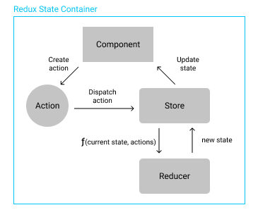

# Fluxor Demo

## What is State Management?

State management is a crucial concept in application development, especially for **single-page applications (SPAs)** like those built with Blazor. It involves managing the state of an application, which includes the data and UI state. Effective state management ensures that the application behaves consistently and predictably, making it easier to debug and maintain.

## What is Fluxor?

Fluxor is a state management library for Blazor applications inspired by Redux. It provides a predictable state container for managing the state of your Blazor application. Fluxor helps in building applications that are easier to test and debug by following the same principles as Redux, such as having a single source of truth and using pure functions to manage state changes.

Fluxor integrates seamlessly with Blazor, allowing you to manage state in a way that is consistent and scalable. It provides tools and patterns to handle state changes, side effects, and UI updates efficiently.

## Key Terms



- **Store**: The store holds the entire state of the application. It is a single source of truth, meaning all state is centralized in one place.
- **Action**: Actions are plain objects that describe what happened. They are the only way to send data to the store. Each action has a type and may have additional data.
- **Dispatcher**: The dispatcher is a central hub that manages all actions. It sends actions to the store to be processed.
- **Reducer**: Reducers are pure functions that take the current state and an action as arguments and return a new state. They specify how the state changes in response to an action.
- **Effect**: Effects handle side effects, such as API calls or other asynchronous operations. They listen for specific actions and perform tasks that are outside the scope of reducers.

Now that we've covered the basics of state management and the key terms in Redux, let's see how these concepts come to life in a Blazor application using Fluxor.

## Create Project 🔨

1. Select **Blazor WebAssembly Standalone App** template.


1. Provide your project name and location.


1. Ensure **Configure for HTTPS** and **Include sample pages** are selected.


## Set Up Fluxor 🛠️

1. Install the latest versions of Fluxor

```csharp
<PackageReference Include="Fluxor" Version="6.1.0" />
<PackageReference Include="Fluxor.Blazor.Web" Version="6.1.0" />
```

1. Add Fluxor services in **Program.cs**

```csharp
builder.Services.AddFluxor(o => o.ScanAssemblies(typeof(Program).Assembly));
```

1. Add the following lines in **_Imports.razor**

```csharp
@using Fluxor
@using Fluxor.Blazor.Web.Components
```

1. Add this to the very top of the **App.razor** file

```csharp
<Fluxor.Blazor.Web.StoreInitializer />
```

1. Fluxor is all set! 🎉

## Counter 🔢

1. Create folder **\Features\Counter**
2. Create **CounterState** that stores the current count value.

```csharp
public record CounterState
{
    public int CurrentCount { get; init; }
}
```

1. Create **CounterFeature** to expose the CounterState to Fluxor.

```csharp
public class CounterFeature : Feature<CounterState>
{
    public override string GetName() => "Counter";

    protected override CounterState GetInitialState()
    {
        return new CounterState
        {
            CurrentCount = 0
        };
    }
}
```

1. Create **CounterActions** file to store all actions. Inside, create **CounterIncrementAction** to dispatch when the button is clicked, instructing the store to increment the counter.

```csharp
public record CounterIncrementAction();
```

1. Create **CounterReducers** file to store all reducer functions. Inside, **OnIncrement** function to handle the increment action when it is dispatched.

```csharp
public static class CounterReducers 
{
    [ReducerMethod(typeof(CounterIncrementAction))]
    public static CounterState OnIncrement(CounterState state) 
    {
        return state with
        {
            CurrentCount = state.CurrentCount + 1
        };
    }
}
```

<aside>
💡

A Reducer method is static as it should be a pure method with no side effects. 

</aside>

1. Update Counter razor page.

Counter.razor

```csharp
@page "/counter"

@inherits FluxorComponent

<PageTitle>Counter</PageTitle>

<h1>Counter</h1>

<p role="status">Current count: @CounterState.Value.CurrentCount</p>

<button class="btn btn-primary" @onclick="IncrementCount">Increment</button>
```

Counter.razor.cs

```csharp
public partial class Counter : FluxorComponent
{
    [Inject]
    protected IDispatcher Dispatcher { get; set; }

    [Inject]
    protected IState<CounterState> CounterState { get; set; }

    private void IncrementCount()
    {
        Dispatcher.Dispatch(new CounterIncrementAction());
    }
}
```

1. Let’s create a decrement and reset functions.
    1. Add the new counter actions to CounterActions.cs
    
    ```csharp
    public record CounterDecrementAction();
    public record CounterResetAction();
    ```
    
    b.  Add reset reducer function to CounterReducers.cs
    
    ```csharp
    [ReducerMethod(typeof(CounterDecrementAction))]
    public static CounterState OnDecrement(CounterState state)
    {
        if (state.CurrentCount == 0)
        {
            return state;
        }
    
        return state with
        {
            CurrentCount = state.CurrentCount - 1
        };
    }
    
    [ReducerMethod(typeof(CounterResetAction))]
    public static CounterState OnReset(CounterState state)
    {
        return state with
        {
            CurrentCount = 0
        };
    }
    ```
    
    c. Add decrement and reset buttons
    
    ```csharp
    <button class="btn btn-secondary" @onclick="DecrementCount">Decrement</button>
    
    <button class="btn btn-danger" @onclick="ResetCount">Reset</button>
    ```
    
    d. Dispatch the new actions
    
    ```csharp
    private void DecrementCount()
    {
        Dispatcher.Dispatch(new CounterDecrementAction());
    }
    
    private void ResetCount()
    {
        Dispatcher.Dispatch(new CounterResetAction());
    }
    ```
    
2. Counter is all set! 😎

## Weather Forecasts 🌥️🌡️

1. Create **WeatherState**

```csharp
public record WeatherState
{
    public bool Initialized { get; init; }
    public bool Loading { get; init; }
    public WeatherForecast[] Forecasts { get; init; }
}
```

1. Let’s breakdown the process of fetching weather forecasts:
    1. Start initialization - set **Initialized** to True, **Loading** to False, and **Forecasts** to empty list.
    2. Load weather forecasts - set **Loading** to True, and fetch weather forecasts data externally.
    3. Set weather forecasts - set **Forecasts** to weather forecasts data, and set **Loading** to False.
    4. End initialization - set **Initialized** to True.

### Start Initialization

1. Create **WeatherFeature** 

```csharp
public class WeatherFeature : Feature<WeatherState>
{
    public override string GetName() => "Weather";

    protected override WeatherState GetInitialState()
    {
        return new WeatherState
        {
            Initialized = false,
            Loading = false,
            Forecasts = []
        };
    }
}
```

1. Inject Weather state into Weather page.

Weather.razor.cs

```csharp
public partial class Weather : FluxorComponent
{
    [Inject]
    protected IDispatcher Dispatcher { get; set; }

    [Inject]
    protected IState<WeatherState> WeatherState { get; set; }

    private WeatherForecast[] Forecasts => WeatherState.Value.Forecasts;
    private bool Loading => WeatherState.Value.Loading;

    protected override void OnInitialized()
    {
        if (WeatherState.Value.Initialized == false)
        {
		        // TODO: Load weather data
        }
        base.OnInitialized();
    }
}
```

Weather.razor

```csharp
@page "/weather"

@inherits FluxorComponent

<PageTitle>Weather</PageTitle>

<h1>Weather</h1>

<p>This component demonstrates fetching data from the server.</p>

@if (Loading)
{
    <p><em>Loading...</em></p>
}
else
{
    <table class="table">
        <thead>
            <tr>
                <th>Date</th>
                <th>Temp. (C)</th>
                <th>Temp. (F)</th>
                <th>Summary</th>
            </tr>
        </thead>
        <tbody>
            @foreach (var forecast in Forecasts)
            {
                <tr>
                    <td>@forecast.Date.ToShortDateString()</td>
                    <td>@forecast.TemperatureC</td>
                    <td>@forecast.TemperatureF</td>
                    <td>@forecast.Summary</td>
                </tr>
            }
        </tbody>
    </table>
}
```

### Load Weather Forecasts

1. Create folder **\Features\Weather\LoadWeatherForecasts**
2. Create **LoadWeatherForecastsAction**

```csharp
public record LoadWeatherForecastsAction();
```

1. Create **LoadWeatherForecastsReducer** to set Loading to True

```csharp
public  class LoadWeatherForecastsReducer
{
    [ReducerMethod(typeof(LoadWeatherForecastsAction))]
    public static WeatherState OnLoadWeatherForecasts(WeatherState state)
    {
        return state with
        {
            Loading = true
        };
    }
}
```

1. Create **LoadWeatherForecastsEffect** to fetch data externally

```csharp
public class LoadWeatherForecastsEffect(HttpClient http)
{
    [EffectMethod(typeof(LoadWeatherForecastsAction))]
    public async Task LoadForecasts(IDispatcher dispatcher)
    {
        var forecasts = await http.GetFromJsonAsync<WeatherForecast[]>("sample-data/weather.json");
        // TODO: Set weather data
    }
}
```

<aside>
💡

**Effects** are used when you need to perform side effects that cannot be handled by pure reducers. Some common use cases are as followed:

1. Data fetching - making HTTP requests to fetch data from an API.
2. Interact with other services - one good example is listening for messages from a SignalR hub and dispatches actions to update the state in response to those messages.
3. Complex logic - complex business logic with multiple steps or asynchronous operations.
</aside>

### Set Weather Forecasts

1. Create folder **\Features\Weather\SetWeatherForecasts**
2. Create **SetWeatherForecastsAction** that accepts a list of WeatherForecast objects

```csharp
public record SetWeatherForecastsAction(WeatherForecast[] Forecasts);
```

1. Create **SetWeatherForecastsReducer** to set Forecasts to the list of objects and set Loading to False.

```csharp
public class SetWeatherForecastsReducer
{
    [ReducerMethod]
    public static WeatherState OnSetForecasts(
        WeatherState state, SetWeatherForecastsAction action)
    {
        return state with
        {
            Forecasts = action.Forecasts,
            Loading = false
        };
    }
}
```

1. Dispatch **SetWeatherForecastsAction** from **LoadWeatherForecastsEffect**

```csharp
dispatcher.Dispatch(new SetWeatherForecastsAction(forecasts));
```

1. Dispatch **LoadWeatherForecastsAction** in Weather.razor.cs

```csharp
Dispatcher.Dispatch(new LoadWeatherForecastsAction());
```

### End Initialization

1. Create folder **\Features\Weather\SetWeatherInitialized**
2. Create **SetWeatherInitializedAction**

```csharp
public record SetWeatherInitializedAction();
```

1. Create **SetWeatherInitializedReducer** to set Initialized to True

```csharp
public class SetWeatherInitializedReducer
{
    [ReducerMethod(typeof(SetWeatherInitializedAction))]
    public static WeatherState OnSetInitialized(WeatherState state)
    {
        return state with
        {
            Initialized = true
        };
    }
}
```

1. Dispatch **SetWeatherInitializedAction** in in Weather.razor.cs after weather forecasts data has been loaded and set successfully.

```csharp
protected override void OnInitialized()
{
    if (WeatherState.Value.Initialized == false)
    {
        Dispatcher.Dispatch(new LoadWeatherForecastsAction());
        Dispatcher.Dispatch(new SetWeatherInitializedAction()); // Add this line
    }
    base.OnInitialized();
}
```

### Refresh Weather Forecasts

1. Add refresh button in Weather.razor

```csharp
<button class="btn btn-outline-info" @onclick="LoadForecasts">Refresh</button>
```

1. Handle refresh button click.

```csharp
protected override void OnInitialized()
{
  if (WeatherState.Value.Initialized == false)
  {
      LoadForecasts();
      Dispatcher.Dispatch(new SetWeatherInitializedAction());
  }
  base.OnInitialized();
}

private void LoadForecasts()
{
    Dispatcher.Dispatch(new LoadWeatherForecastsAction());
}
```

Weather Forecasts page is all set! 🥂🎇

# Wrap Up

- Fluxor is a Redux-inspired state management library for Blazor that provides a centralized state container and seamless integration⁠.
- State management uses a single source of truth (Store), Actions to describe changes, and Reducers to process state changes⁠. Effects handle side effects like API calls and async operations.
- The Counter example demonstrates basic state management with increment, decrement, and reset functionalities⁠.
- The Weather Forecast example shows a more complex state handling with async data fetching, loading, and initialization flow⁠.
- In conclusion, Fluxor simplifies state management in Blazor applications, making them more predictable and easier to maintain. It's particularly useful for large complex applications with a lot of state changes.